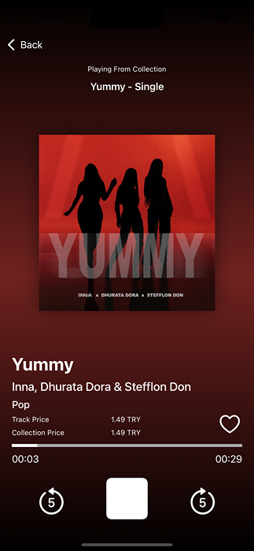

# iTunesApp

 
iTunesApp is a feature-rich music application that harnesses the power of the iTunes API to deliver an immersive and delightful music discovery experience to users. Developed specifically for iOS devices running iOS 13.0 and above, the app offers a seamless and intuitive interface for users to explore and enjoy their favorite music.

With iTunesApp, users can dive into a vast collection of songs, albums, and artists available through the iTunes API. The app provides a comprehensive search functionality, allowing users to easily find their desired tracks and discover new music across various genres.

Designed with a focus on user experience, iTunesApp employs a clean and visually appealing interface that enhances the enjoyment of music discovery. The app prioritizes simplicity and ease of use, ensuring that users can navigate through their music library and explore new releases with minimal effort.

Under the hood, iTunesApp utilizes the VIPER (View, Interactor, Presenter, Entity, Router) design pattern, which promotes maintainability, scalability, and testability. This architectural approach separates different components of the app, facilitating efficient development and future enhancements.

In addition to the core search and discovery features, iTunesApp offers a range of functionalities to enrich the music listening experience. Users can favorite their beloved songs, allowing for quick access to personal favorites. Moreover, the app provides convenient playback controls, enabling users to play, pause, skip forward, and skip backward while enjoying their music.

To enhance the visual appeal of the app, iTunesApp seamlessly integrates with the SDWebImage library for asynchronous image loading and caching. This ensures that album artwork and artist images are displayed promptly and vividly, adding an aesthetic touch to the overall music browsing experience.

## Features

- Search and Discover Music: iTunesApp allows users to explore and search for their favorite songs, albums, and artists using the powerful iTunes API. The app provides a user-friendly interface to browse through a vast collection of music.

- VIPER Architecture: The app is built using the VIPER (View, Interactor, Presenter, Entity, Router) design pattern. This architectural approach ensures a clean separation of concerns and facilitates easier maintenance and scalability of the codebase.

- Song Favoriting: Users can mark their favorite songs for quick access. The app provides an intuitive way to manage and organize a personalized collection of favorite tracks.

- Playback Controls: iTunesApp offers convenient playback controls, allowing users to play, pause, skip forward, and skip backward while listening to their favorite songs. These controls are readily available on the search screen for a seamless and uninterrupted music experience.

- Rich Song Details: The app provides comprehensive song information, including album artwork, artist details, and track metadata. Users can explore details about their favorite songs, view album covers, and learn more about the artists behind the music.
- Dynamic Color Themes: iTunesApp enhances the visual experience by dynamically changing the app's color theme based on the dominant colors in the song cover artwork. This feature adds a visually immersive element that adapts to the mood and style of the music being played.
    
-   Search and Play: Users can search for songs, albums, or artists and play them directly within the app. The app seamlessly integrates with the iTunes API, fetching and streaming the selected music for an uninterrupted listening experience.

## Screenshots

  

 

 

## Unit Tests

The project includes comprehensive unit tests to ensure the functionality and reliability of the codebase. These tests cover various components, such as presenters, interactors, and service managers. You can find the unit tests in the `ITunesAppTests` directory.

## UI Tests

In addition to unit tests, iTunesApp includes UI tests to verify the app's user interface and interactions. These tests use XCTest framework and can be found in the `ITunesAppUITests` directory.

## How to Run

1. Clone the repository to your local machine.
2. Open Xcode and select `ITunesApp.xcodeproj` to open the project.
3. Choose an iOS simulator or a connected device and run the project.

## Dependencies

The project uses the following dependency:

- SDWebImage: A Swift library for asynchronous image loading and caching.

This dependency can be managed automatically using CocoaPods or Swift Package Manager within the project.

## Contributions

If you would like to contribute to MyMusicApp, please follow these steps:

1. Fork the repository.
2. Create a new feature branch: `git checkout -b my-new-feature`
3. Make your changes and commit them: `git commit -am 'Add some feature'`
4. Push to the branch: `git push origin my-new-feature`
5. Create a new Pull Request (PR).

## License

This project is licensed under the MIT License.
